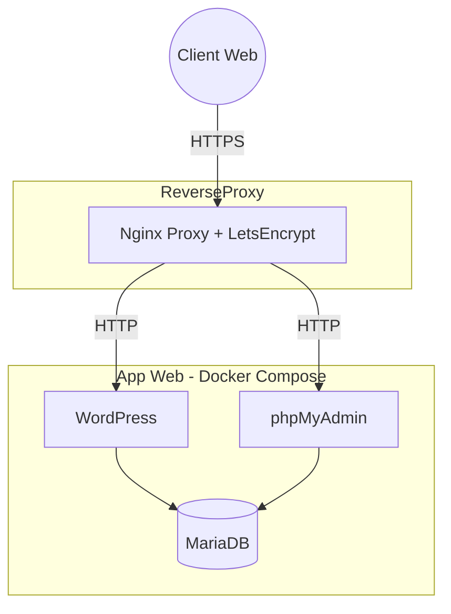

# Projet Conteneurisation v1

## Objectifs du projet

Ce projet a été réalisé dans le cadre du module d’Orchestration de Conteneurs.  
Il permet de :
  - Conteneuriser une application Web complète  
  - Utiliser Dockerfile + Docker Compose (multi-services)  
  - Déployer l'application sur une VM Cloud  
  - Exposer l'application sur Internet via un reverse proxy  
  - Ajouter un certificat SSL/TLS Let’s Encrypt automatique  
  - Automatiser la configuration via des variables `.env`  
  - Héberger la base de données de manière persistante
    
=> Toutes les étapes sont reproductibles grâce aux fichiers présents sur GitHub.

### Architecture technique

L’architecture se compose de **3 services Docker** :

| Service | Image | Rôle |
|--------|------|-----|
| MariaDB | mariadb:10.11 | Stockage des données WordPress |
| WordPress | wordpress:latest | Serveur Web + application PHP |
| phpMyAdmin | phpmyadmin:latest | Interface de gestion SQL |

- Réseau Docker interne 'local'
- Reverse proxy Nginx pour l'exposition publique
- Certificats automatiques Let's Encrypt



### Contenu du dépôt

  - Dockerfile -> Multi-usage : WordPress / MariaDB / phpMyAdmin
  - docker-compose.yml -> Déploiement multi-containers
  - .env -> Variables d'environnement

Ce sont les 3 ressources nécessaires pour reproduire le déploiement.

## Déploiement

Déploiement sur un VM

### Installer Docker

```bash
$ curl -fsSL https://get.docker.com | sh
$ sudo usermod -aG docker $USER
$ newgrp docker
```

### Cloner le dépôt

```bash
$ git clone https://github.com/Mateo-ynov/wordpress.git
```

### Lancer les conteneurs

```bash
$ docker compose build
$ docker compose up -d
```

### Vérifier le lancement

```bash
$ docker compose ps
```

## Tests de validation

### Test reverse proxy

```bash
$ curl -I -H "Host: wordpress-ynov.duckdns.org" http://127.0.0.1
```

### Test du certificat

```bash
$ curl -v https://wordpress-ynov.duckdns.org
```

## Auteurs

Loïc LAMBERT  
Bastien DURCHON  
Matéo PARNY  
M2 INFRA Ynov
