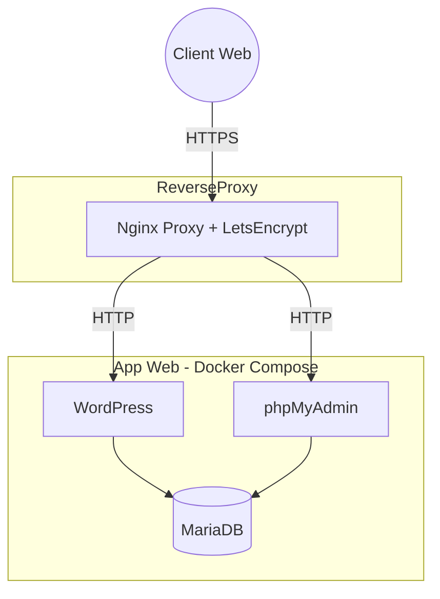

# Projet Conteneurisation v1 - WordPress / MariaDB / phpMyAdmin

Démo publique : https://wordpress-ynov.duckdns.org

## Objectifs du projet

Ce projet a été réalisé dans le cadre du module d’Orchestration de Conteneurs.  
Il permet de :
  - Conteneuriser une application Web complète  
  - Utiliser Dockerfile + Docker Compose (multi-services)  
  - Déployer l'application sur une VM Cloud  
  - Exposer l'application sur Internet via un reverse proxy  
  - Ajouter un certificat SSL/TLS Let’s Encrypt automatique  
  - Automatiser la configuration via des variables `.env`  
  - Héberger la base de données de manière persistante
    
=> Toutes les étapes sont reproductibles grâce aux fichiers présents sur GitHub.

## Architecture technique

L’architecture se compose de **3 services Docker** :

| Service | Image | Rôle |
|--------|------|-----|
| MariaDB | mariadb:10.11 | Stockage des données WordPress |
| WordPress | wordpress:latest | Serveur Web + application PHP |
| phpMyAdmin | phpmyadmin:latest | Interface de gestion SQL |

- Réseau Docker interne 'local'
- Reverse proxy Nginx pour l'exposition publique
- Certificats automatiques Let's Encrypt



## Contenu du dépôt

  - Dockerfile -> Multi-usage : WordPress / MariaDB / phpMyAdmin
  - docker-compose.yml -> Déploiement multi-containers
  - .env -> Variables d'environnement

Ce sont les 3 ressources nécessaires pour reproduire le déploiement.

## Déploiement

Déploiement sur un VM

### Installer Docker

```bash
curl -fsSL https://get.docker.com | sh
sudo usermod -aG docker $USER
newgrp docker
```

### Cloner le dépôt

```bash
git clone https://github.com/Mateo-ynov/wordpress.git
```

### Lancer les conteneurs

```bash
docker compose build
docker compose up -d
```

### Vérifier le lancement

```bash
docker compose ps
```
## Sécurisation et Reverse Proxy

Le conteneur WordPress n’est pas exposé directement sur Internet.

Le reverse proxy Nginx :
  - écoute sur les ports 80 et 443
  - termine les connexions HTTPS
  - génère automatiquement la configuration Nginx
  - obtient les certificats via Let’s Encrypt
  - route les requêtes selon le `Host Header`

Variables définies dans le `.env` :
```bash
VIRTUAL_HOST=wordpress-ynov.duckdns.org
LETSENCRYPT_HOST=wordpress-ynov.duckdns.org
LETSENCRYPT_EMAIL=mateo.parny@ynov.com
```

## Persistance des données

| Volume Docker     | Rôle                                          |
| ----------------- | --------------------------------------------- |
| `mysql_data`      | Sauvegarde de la base MariaDB                 |
| `./` (bind mount) | Fichiers WordPress (uploads, thèmes, plugins) |

=> Ces volumes garantissent que les données restent disponibles après un redémarrage ou un redeploiement.

## Tests de validation

### Vérifier les services
```bash
docker compose ps
```

### Tester la connexion à la base

```bash
docker exec -it db-1 mysql -uroot -pMySQLRootPassword -e "SHOW DATABASES;"
```

### Tester reverse proxy

```bash
curl -I -H "Host: wordpress-ynov.duckdns.org" http://127.0.0.1
```

### Vérifier le certificat TLS

```bash
curl -v https://wordpress-ynov.duckdns.org
```

## Démontage / Arrêt du projet

### Arrêter les conteneurs sans tout supprimer

```bash
docker compose down
```

### Supprimer les conteneurs et les volumes associés

```bash
docker compose down -v
```

### Nettoyer les images inutilisées

```bash
docker image prune -f
```

## Cycle de vie Docker

| Action             | Commande                              |
| ------------------ | ------------------------------------- |
| Démarrer le projet | `docker compose up -d`                |
| Arrêter le projet  | `docker compose down`                 |
| Voir les logs      | `docker compose logs -f <service>`    |
| Supprimer tout     | `docker system prune -a --volumes -f` |

## Auteurs

Loïc LAMBERT  
Bastien DURCHON  
Matéo PARNY  
M2 INFRA Ynov
